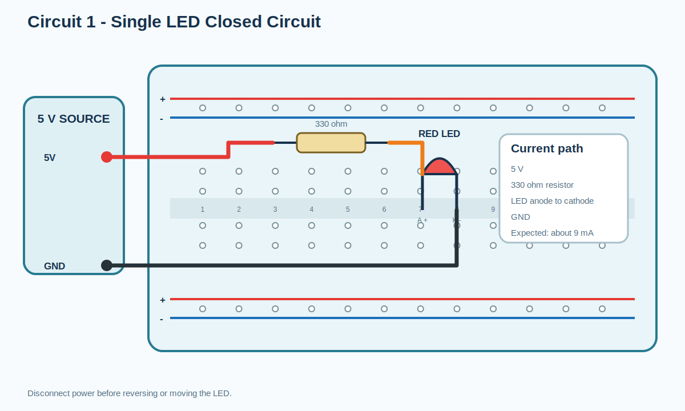
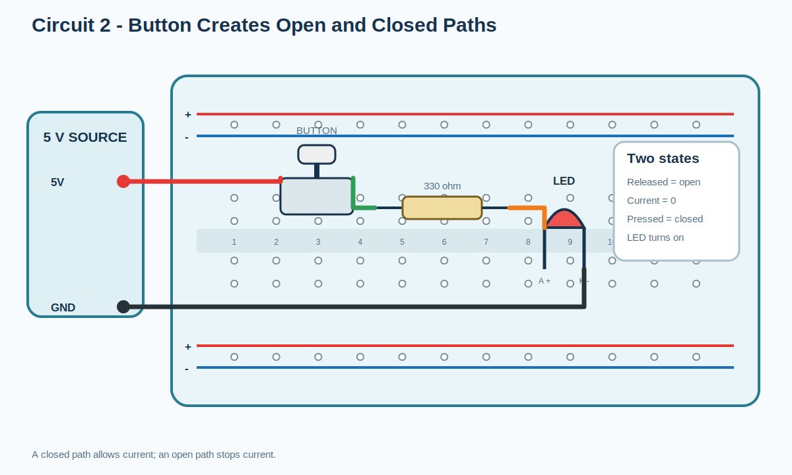
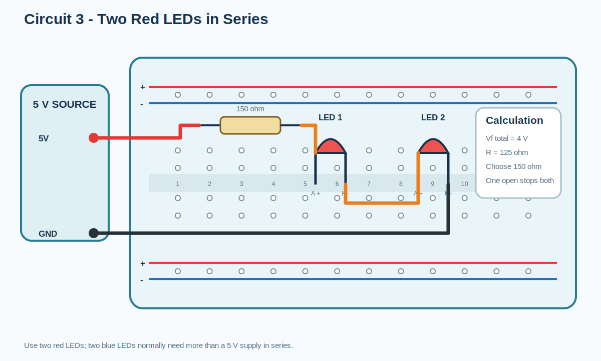
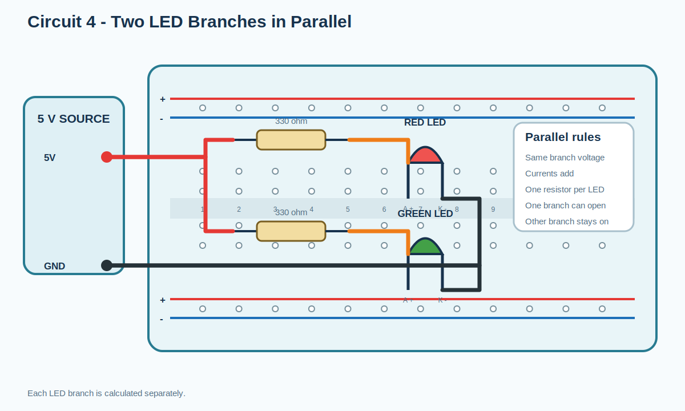
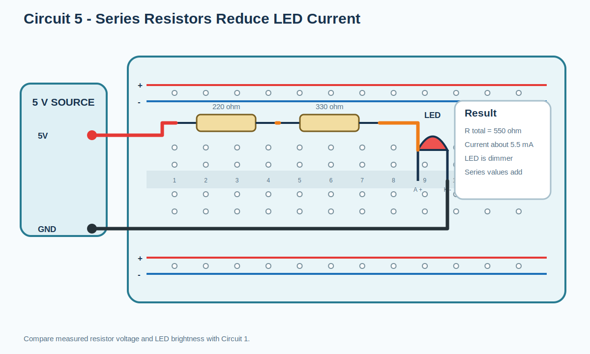
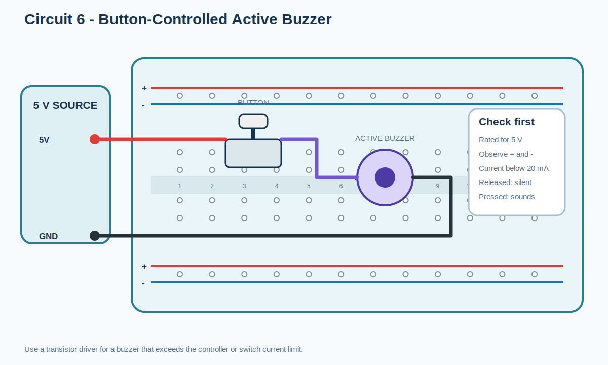
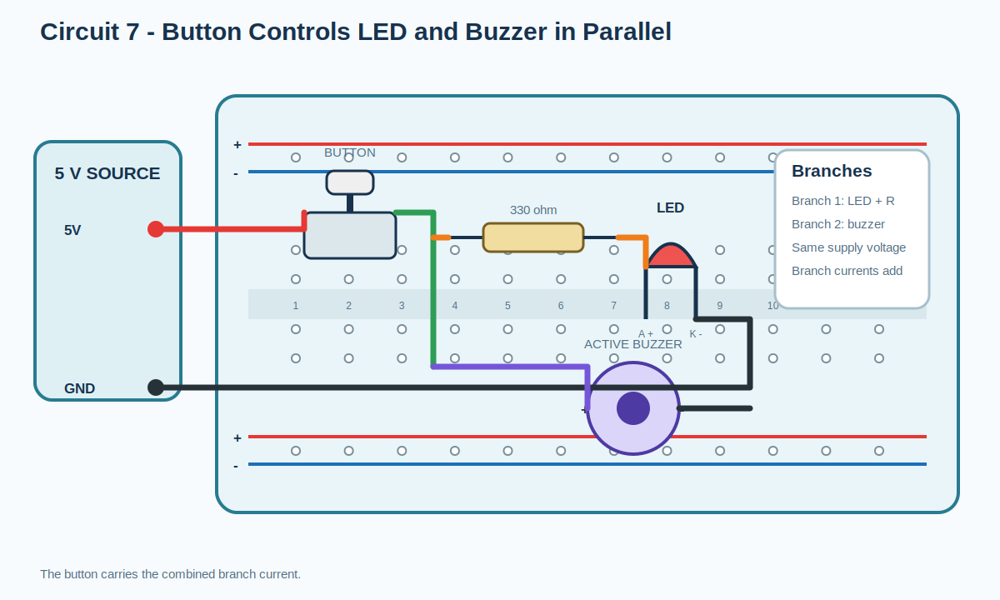
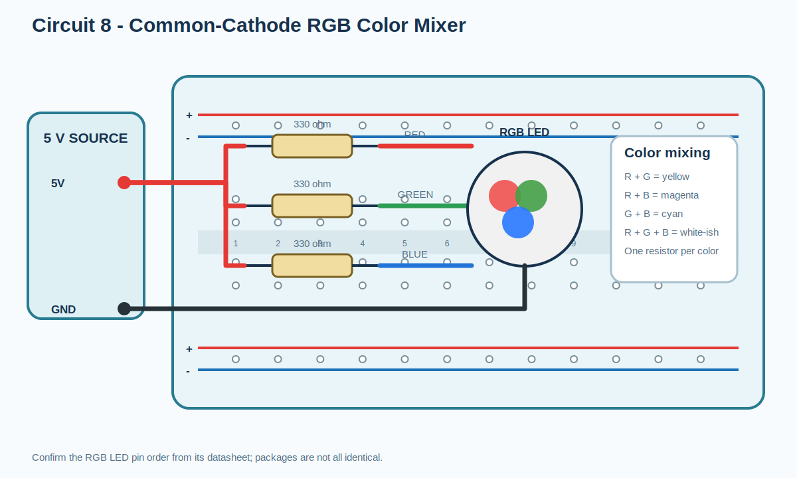
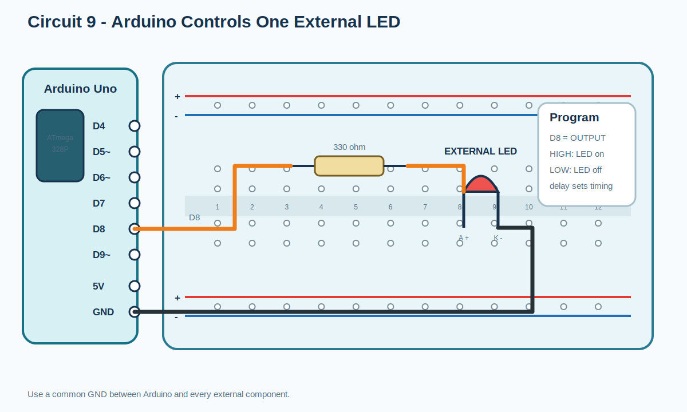
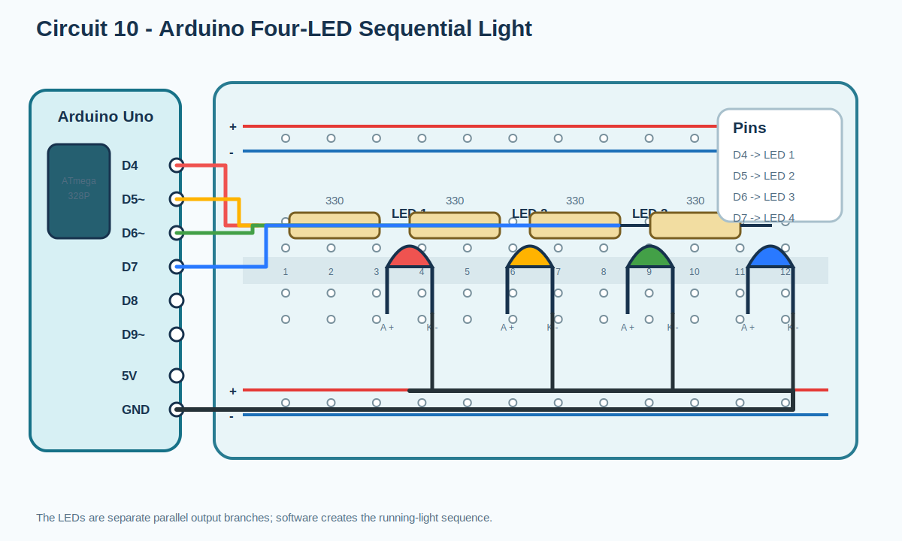

# Session 1 Circuit Diagram Index

All circuit images are editable SVG files. Wiring tables and calculations
are in [Ten Practical Breadboard Circuits](../04-ten-practical-circuits.md).

## Single LED closed circuit

## Button open/closed circuit

## Two LEDs in series

## Two LED branches in parallel

## Series resistors with LED

## Button-controlled active buzzer

## LED and buzzer in parallel

## RGB color mixer

## Arduino external LED

## Arduino four-LED chaser

