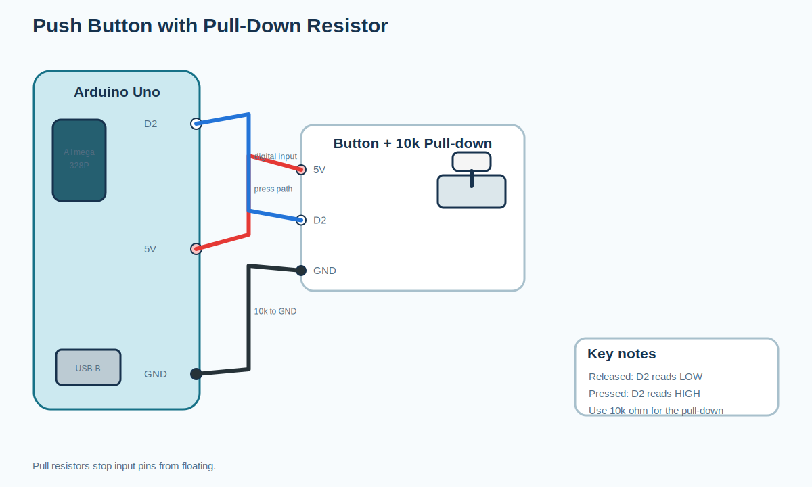
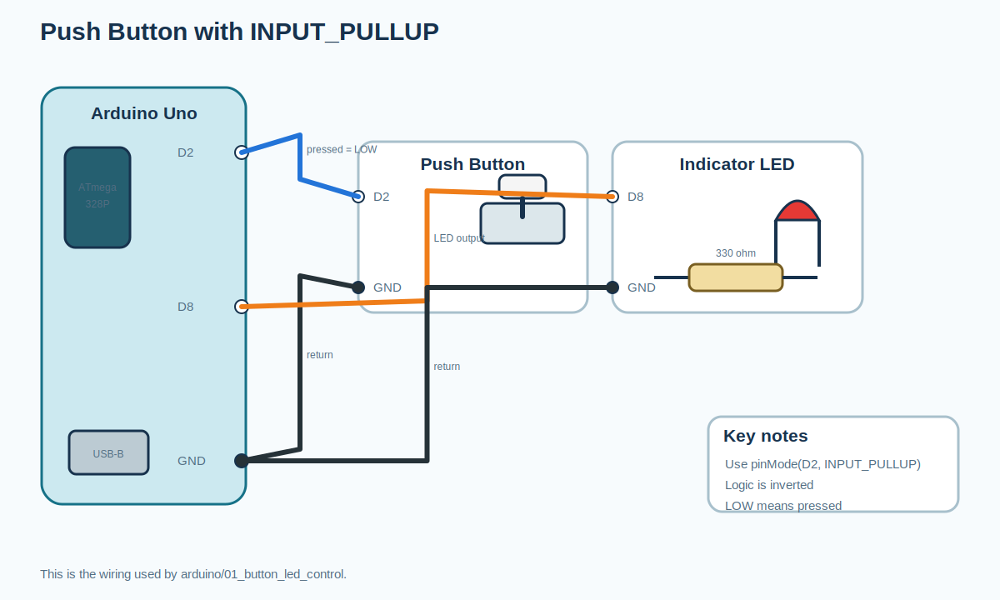
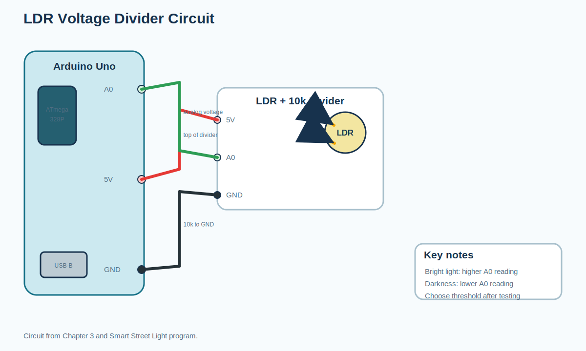
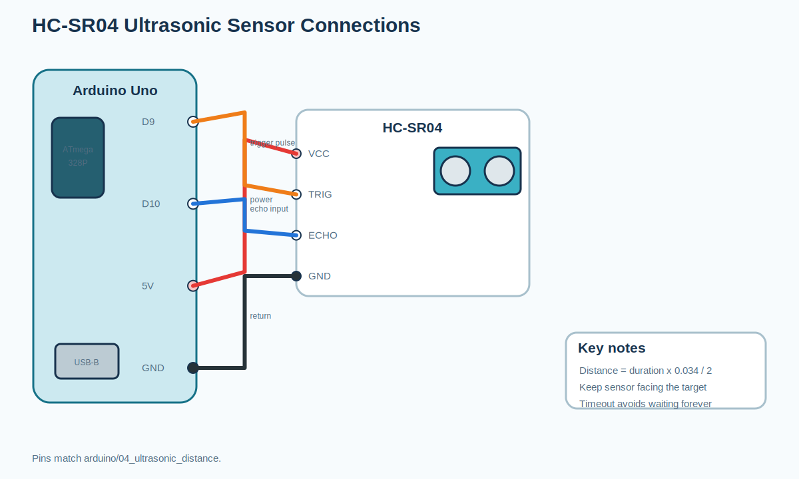
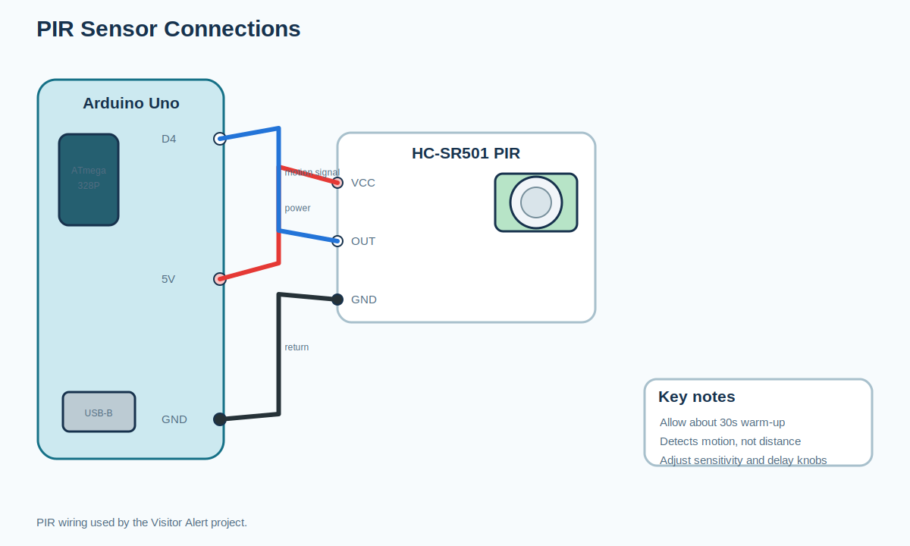
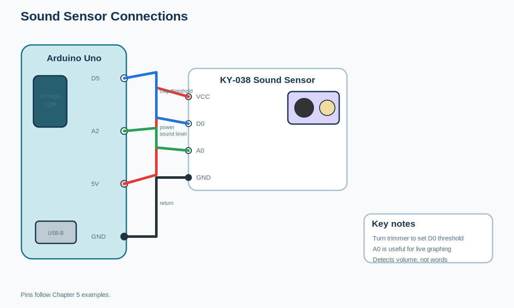
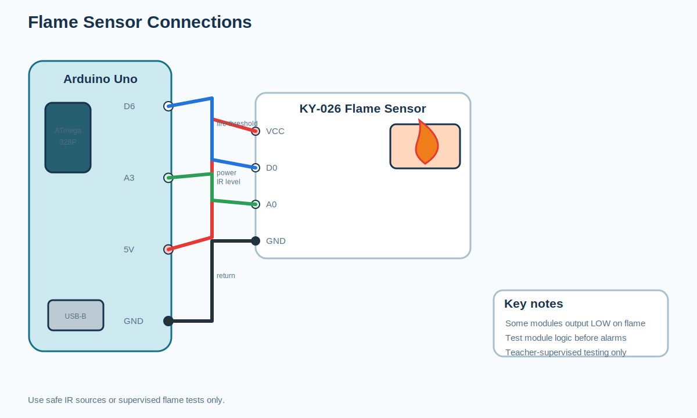
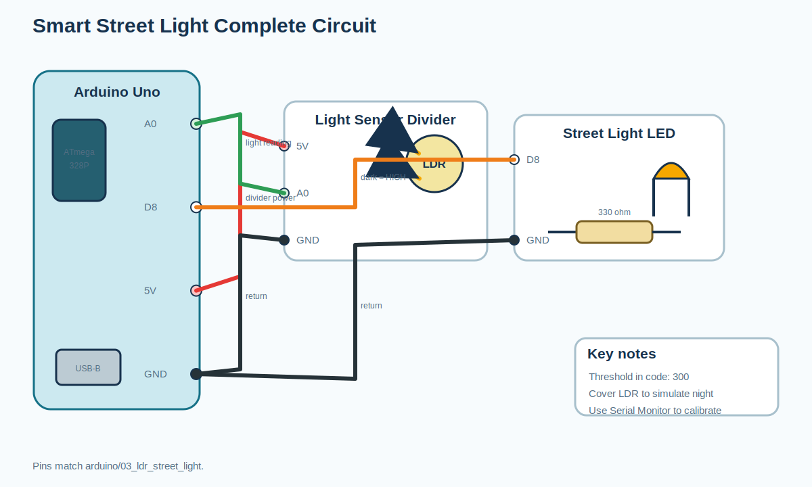
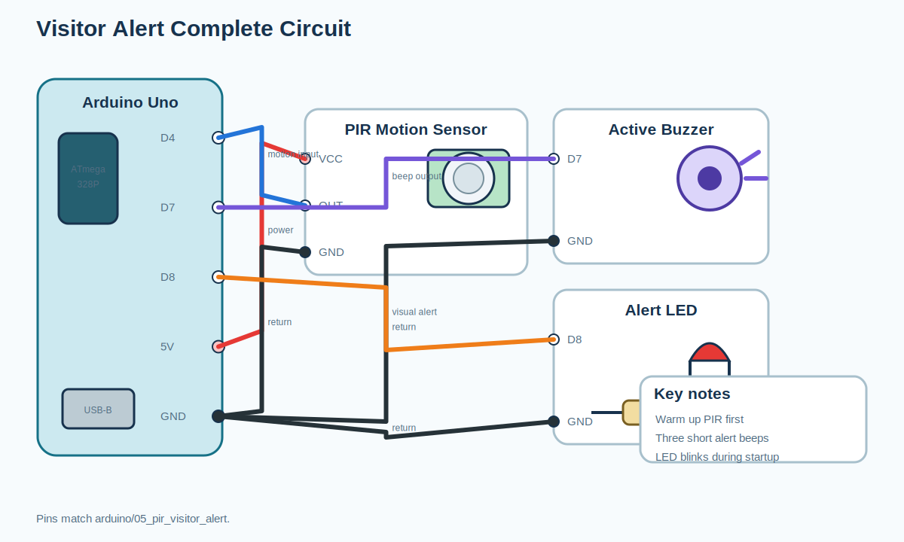
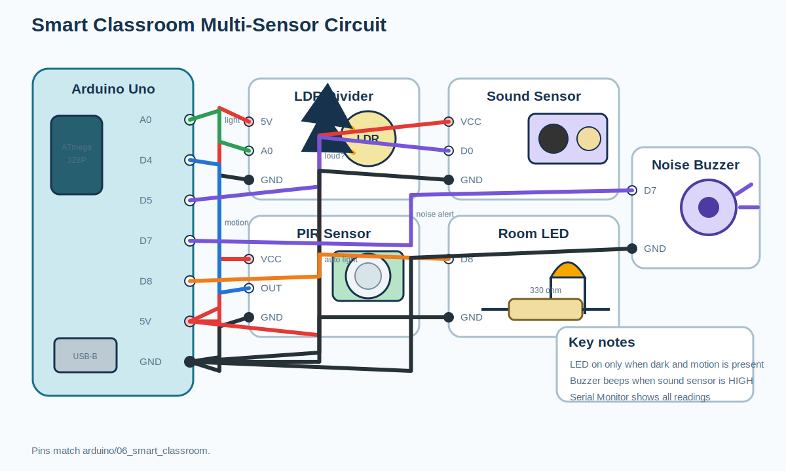

# Circuit Diagrams: Session 2: How Machines Sense the World

All images are editable SVG teaching diagrams generated from the
curriculum notes and Arduino program wiring comments.

## Push button with pull-down resistor

## Push button with INPUT_PULLUP

## LDR voltage divider circuit

## HC-SR04 ultrasonic sensor connections

## PIR sensor connections

## Sound sensor connections

## Flame sensor connections

## Smart Street Light complete circuit

## Visitor Alert complete circuit

## Smart Classroom multi-sensor circuit

