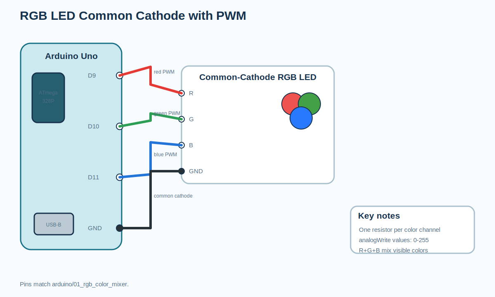
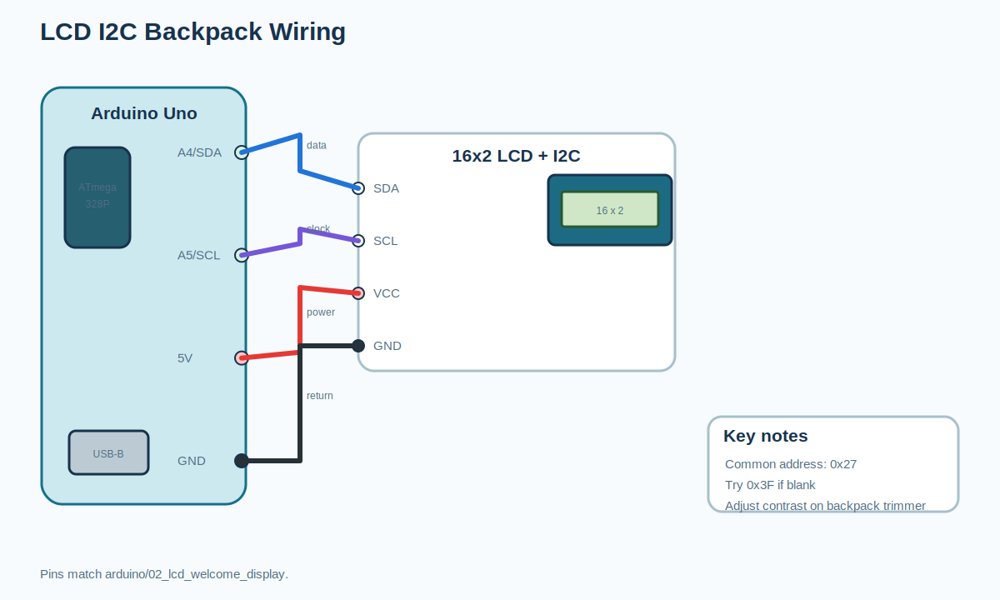
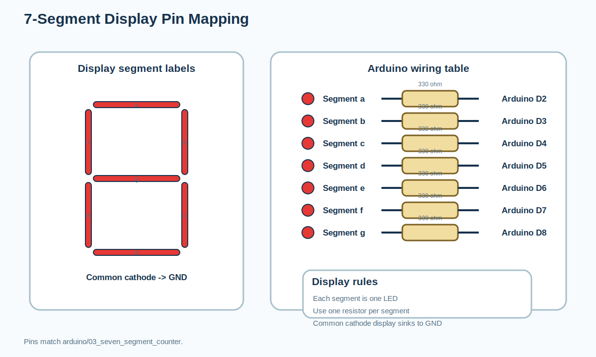
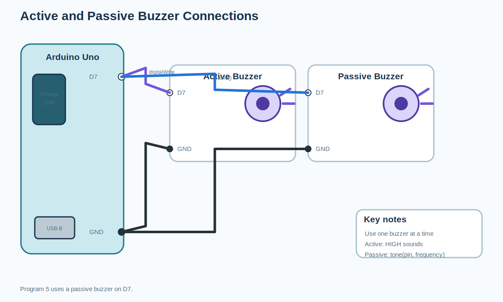
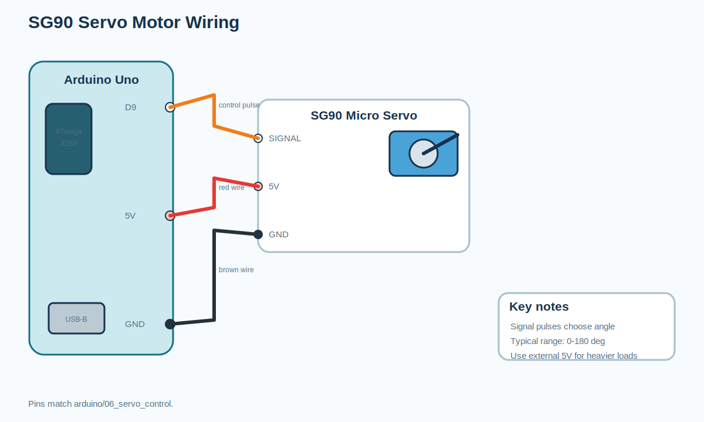
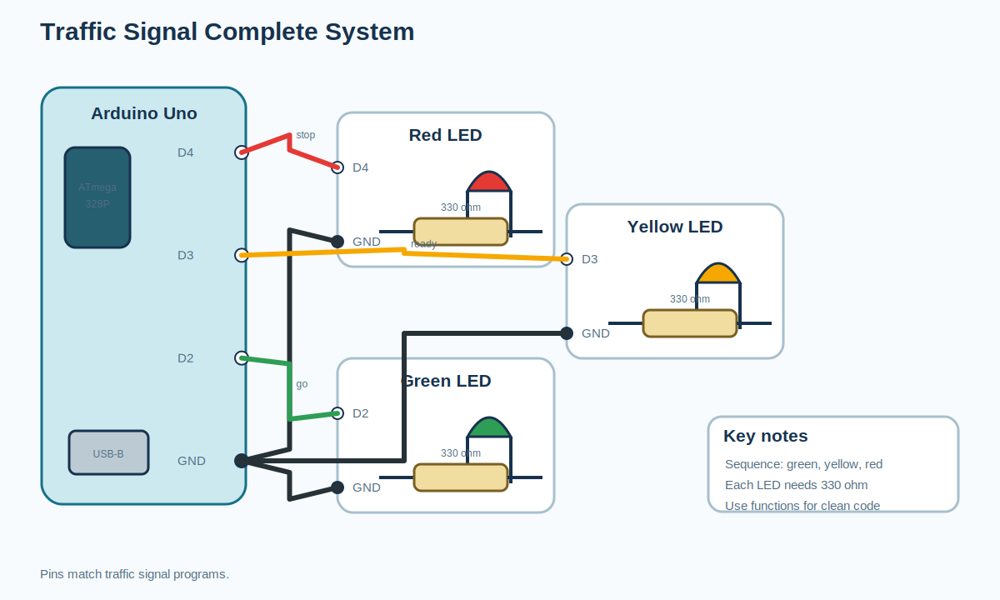
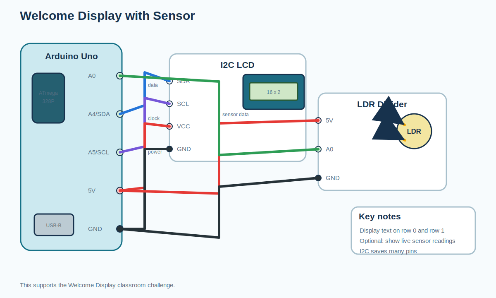
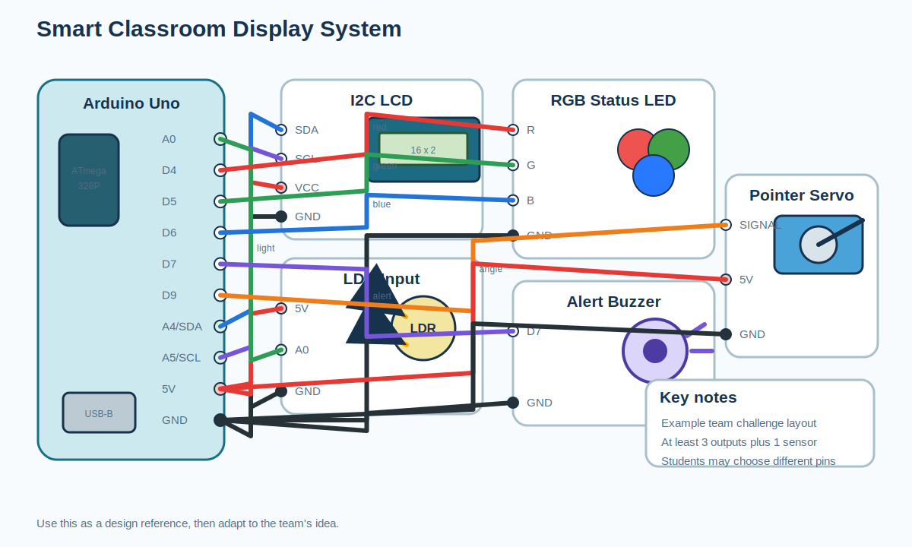

# Circuit Diagrams: Session 3: How Machines Communicate

All images are editable SVG teaching diagrams generated from the
curriculum notes and Arduino program wiring comments.

## RGB LED common cathode with PWM connections

## LCD I2C backpack wiring

## 7-segment display pin mapping

## Traffic signal three-LED circuit

## Active and passive buzzer connections

## SG90 servo motor wiring

## Traffic Signal complete system

## Welcome Display with sensor

## Smart Classroom Display System

