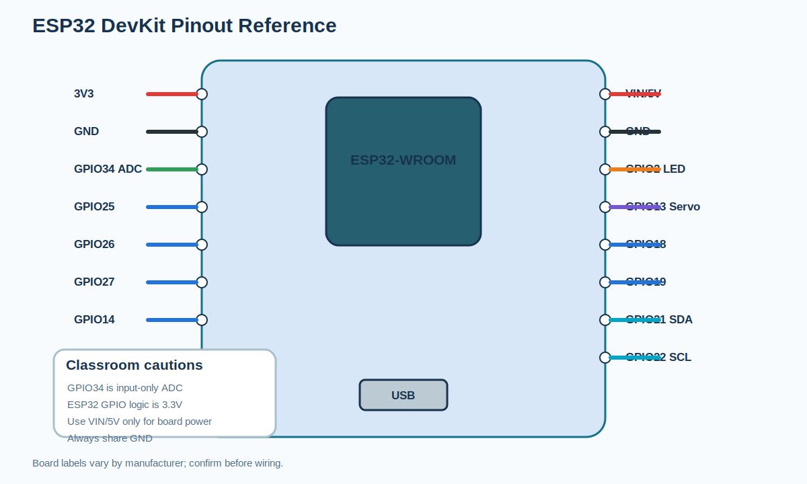
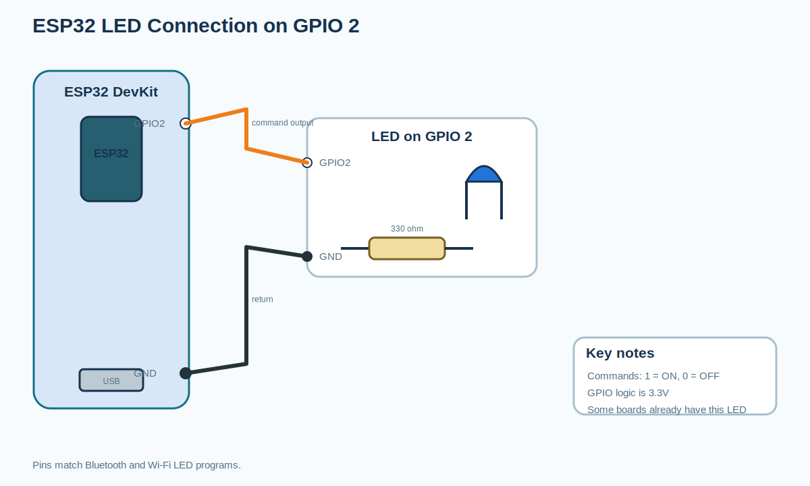
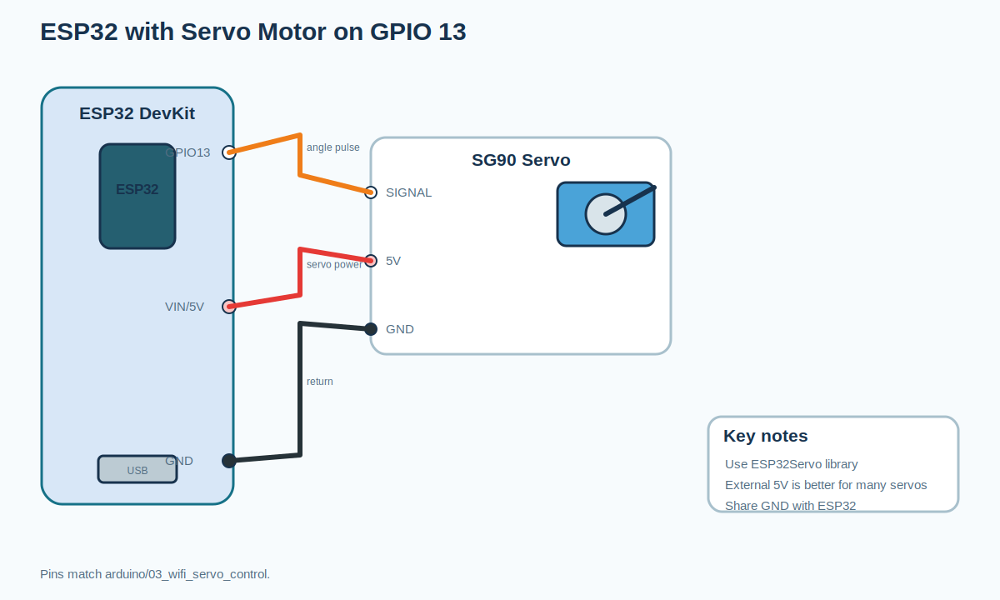
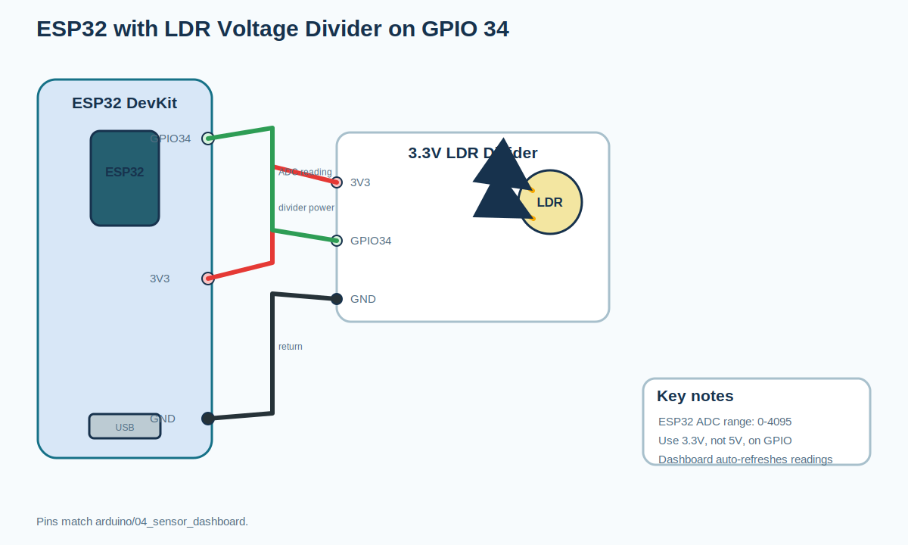
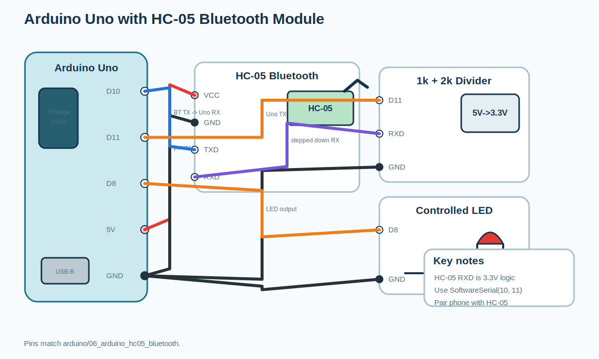
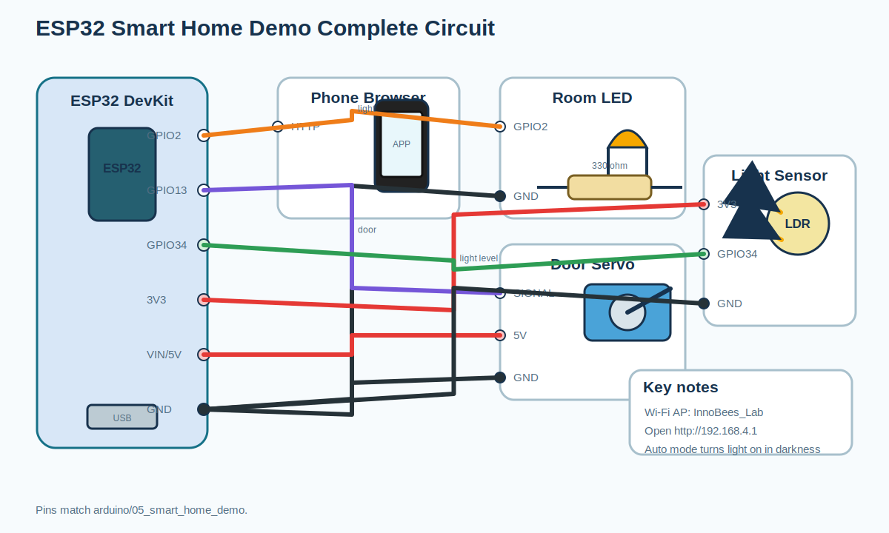
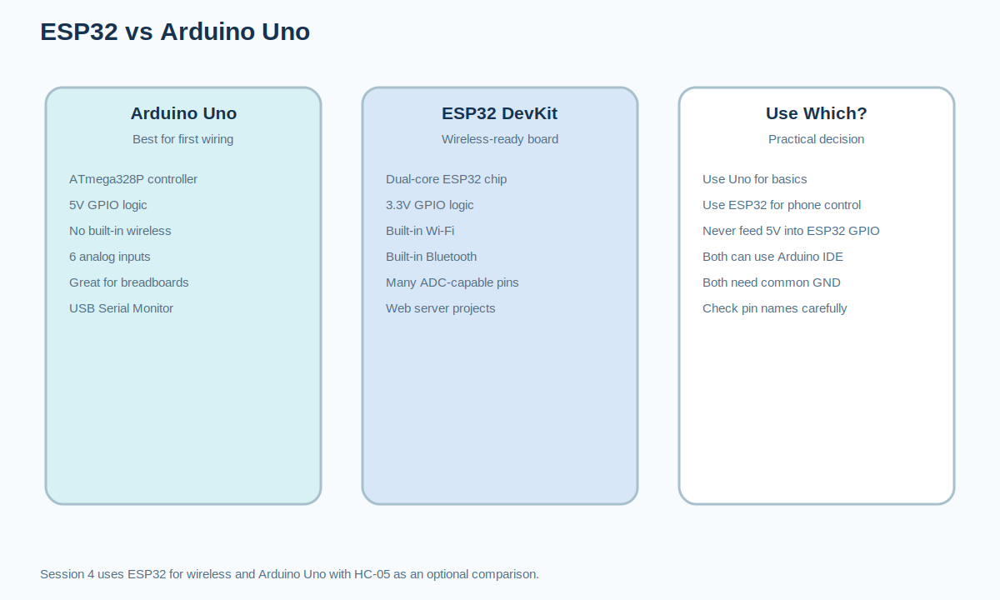

# Circuit Diagrams: Session 4: Control Everything From Your Phone

All images are editable SVG teaching diagrams generated from the
curriculum notes and Arduino program wiring comments.

## ESP32 DevKit pinout reference

## ESP32 LED connection on GPIO 2

## ESP32 with servo motor on GPIO 13

## ESP32 with LDR voltage divider on GPIO 34

## Arduino Uno with HC-05 Bluetooth module

## Smart Home demo complete circuit

## ESP32 vs Arduino Uno comparison diagram

