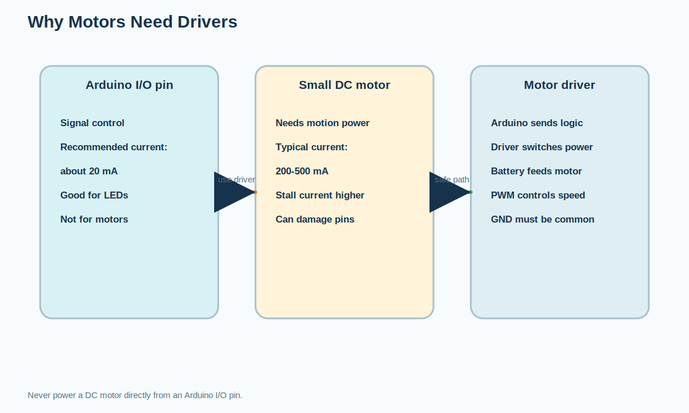
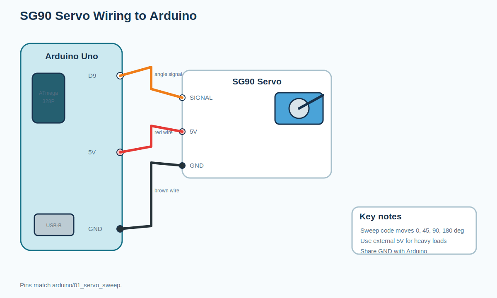
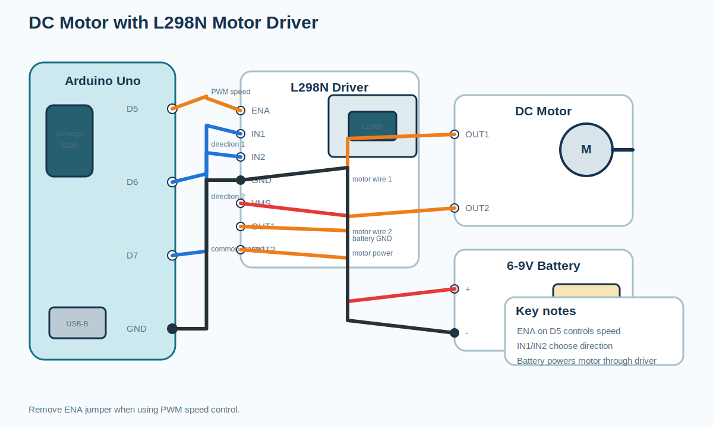
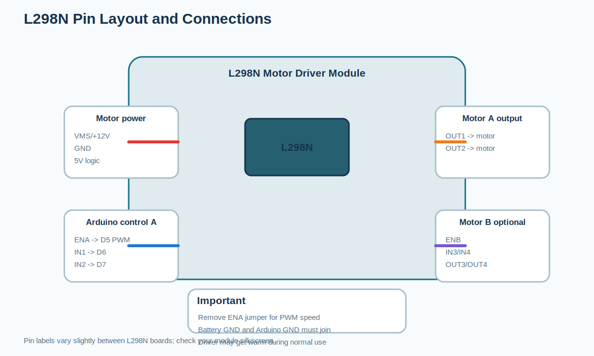
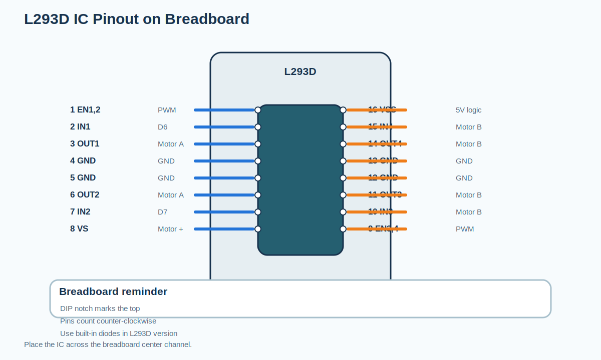
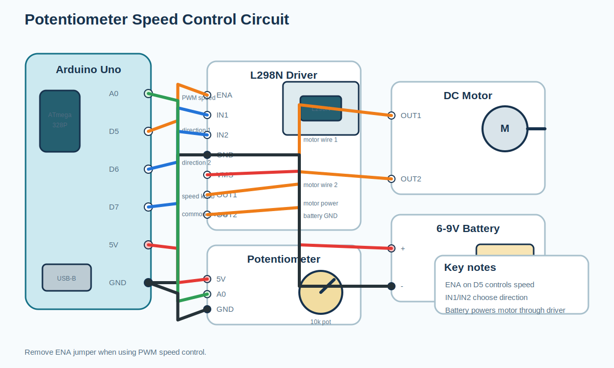
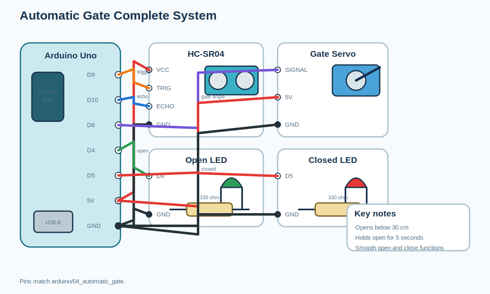
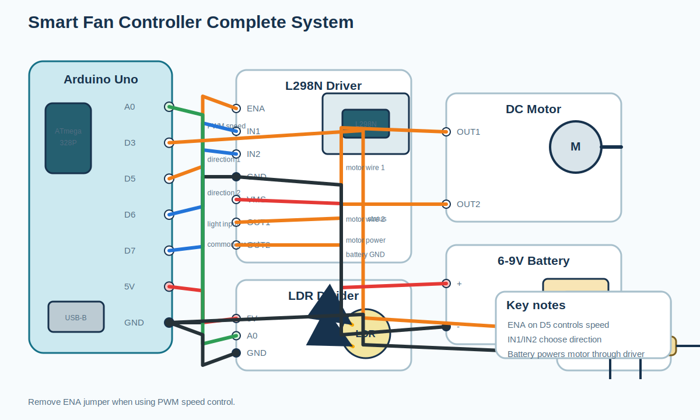
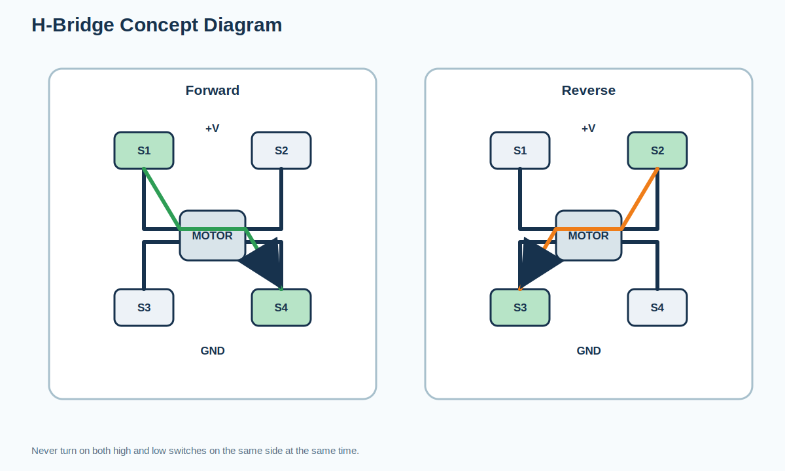
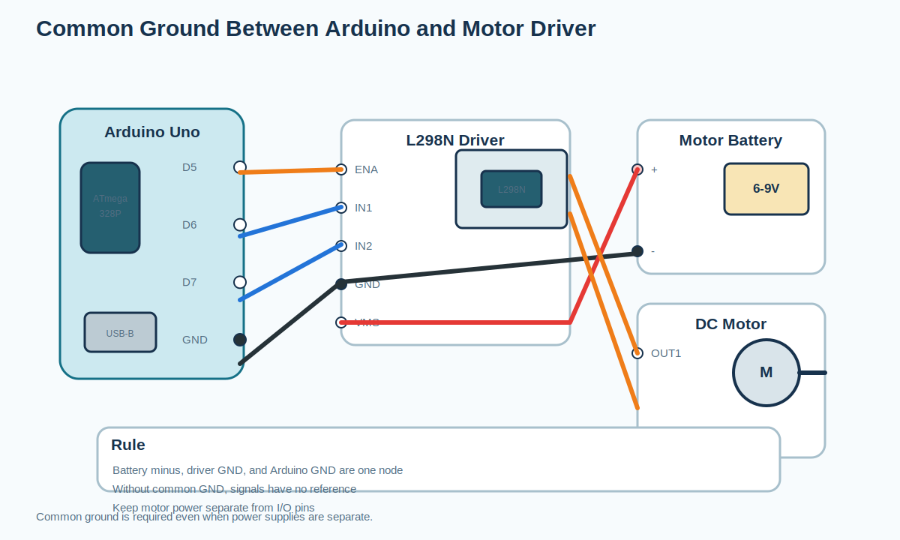

# Circuit Diagrams: Session 5: Bringing Machines to Life

All images are editable SVG teaching diagrams generated from the
curriculum notes and Arduino program wiring comments.

## Why motors need drivers

## SG90 servo wiring to Arduino

## DC motor with L298N motor driver

## L298N pin layout and connections

## L293D IC pinout on breadboard

## Potentiometer speed control circuit

## Automatic Gate complete system

## Smart Fan Controller complete system

## H-bridge concept diagram

## Common ground between Arduino and motor driver

