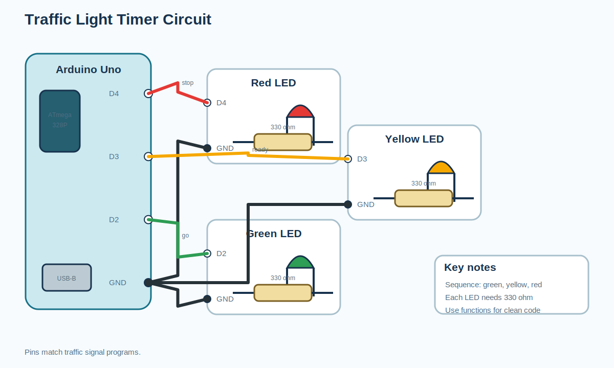
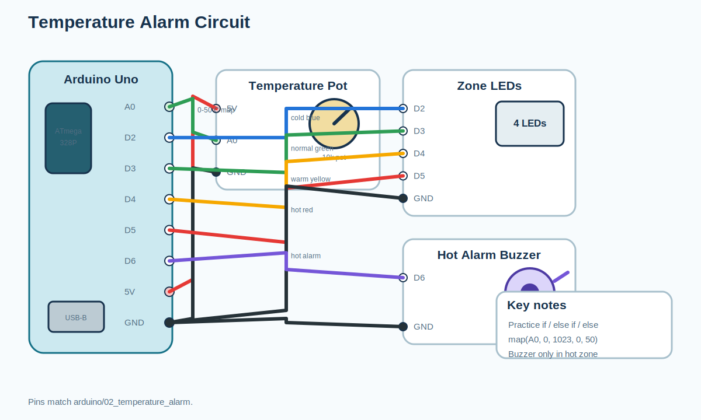
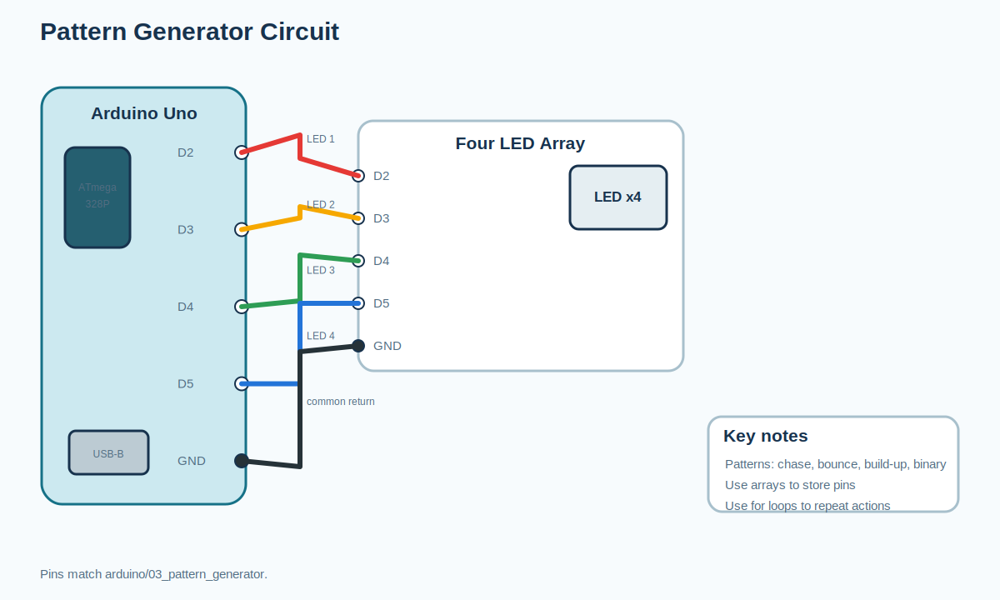
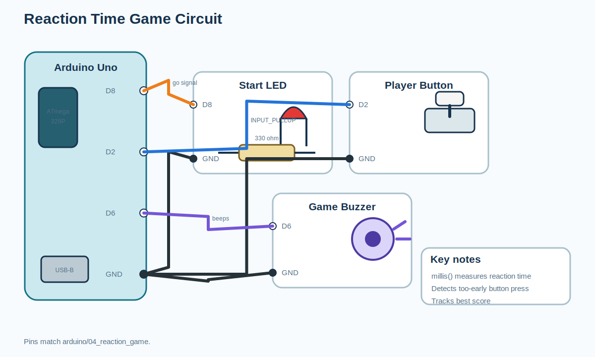
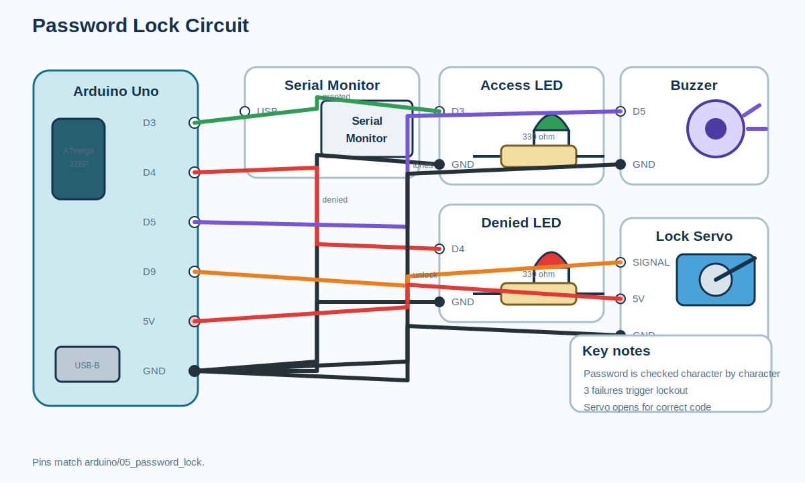
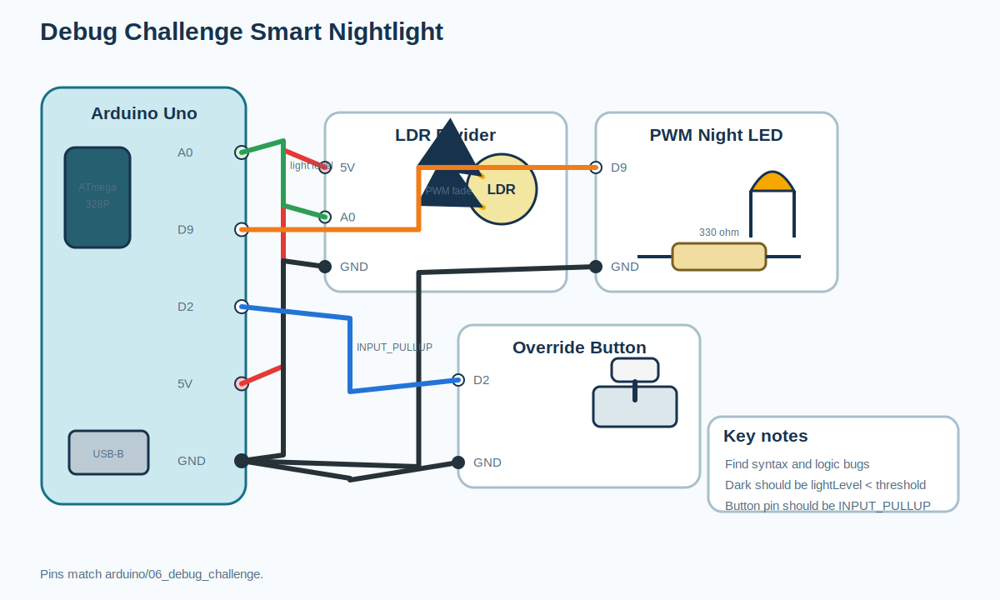

# Circuit Diagrams: Session 6: Think Like a Programmer

All images are editable SVG teaching diagrams generated from the
curriculum notes and Arduino program wiring comments.

## Traffic light timer

## Temperature alarm

## Pattern generator

## Reaction time game

## Password lock

## Debug challenge smart nightlight

